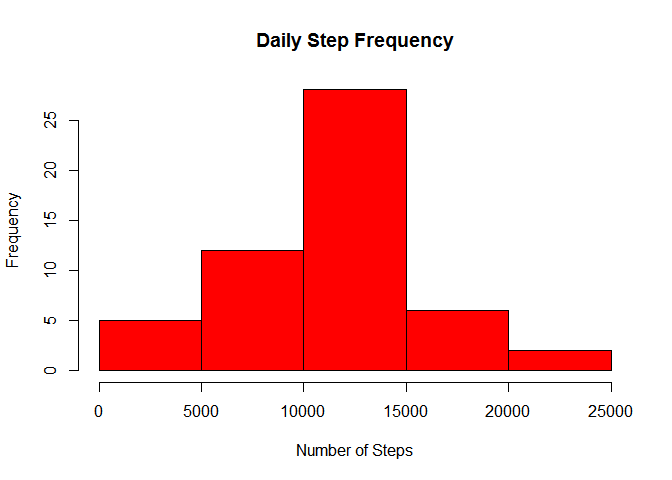
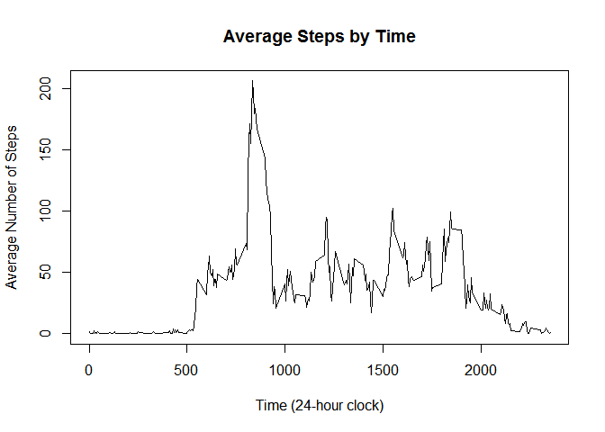
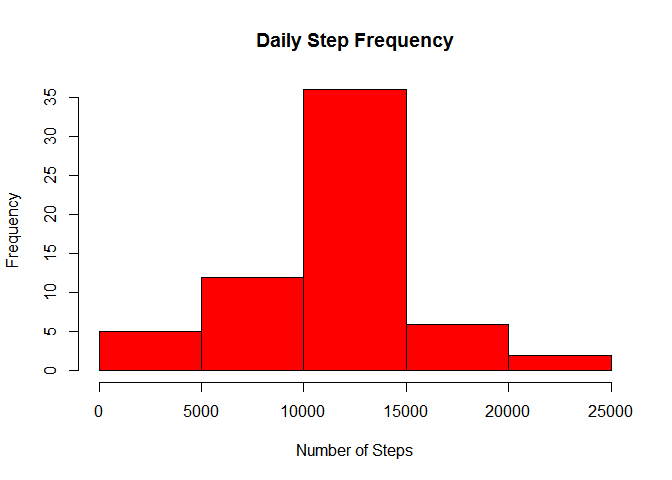
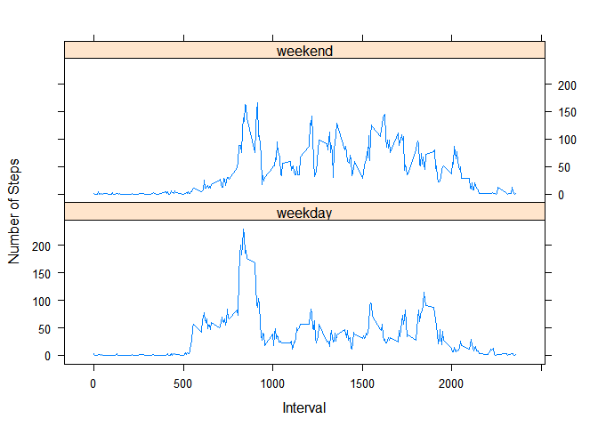

# Reproducible Research: Peer Assessment 1


## Loading and preprocessing the data

```r
stepData <- read.csv(unz("activity.zip","activity.csv"), header=TRUE, quote="\"")
stepData$date <- as.Date(stepData$date, "%Y-%m-%d")
```


## What is mean total number of steps taken per day?

```r
dailyTotalSteps <- aggregate(steps ~ date, stepData, sum)
hist(dailyTotalSteps$steps,
     main="Daily Step Frequency",
     xlab="Number of Steps",
     col="red")
```

 

```r
mean(dailyTotalSteps$steps)
```

```
## [1] 10766.19
```

```r
median(dailyTotalSteps$steps)
```

```
## [1] 10765
```

The mean number of steps each day is 10,766, while
the median number of steps each day is 10,765.


## What is the average daily activity pattern?

```r
intervalMeanSteps <- aggregate(steps ~ interval, stepData, mean)
plot(intervalMeanSteps$interval,
     intervalMeanSteps$steps,
     type="l",
     main="Average Steps by Time",
     xlab="Time (24-hour clock)",
     ylab="Average Number of Steps")
```

 

```r
intervalMeanSteps[which.max(intervalMeanSteps$steps),1]
```

```
## [1] 835
```

The 5-minute interval with the highest average number of steps
is 835.


## Imputing missing values

First calculate the number of rows in the dataset with missing values.

```r
sum(is.na(stepData$steps))
```

```
## [1] 2304
```

There are 2304 rows in the dataset with missing Step values.

To impute a missing number of steps for a given interval, I will use the previously calculated
average number of steps for that interval across all dates, and use that value in place of the missing value.


```r
# Combine main data set with summarized interval data
stepDataImputed <- merge(stepData, intervalMeanSteps, by="interval")
colnames(stepDataImputed)[2] <- "steps"
colnames(stepDataImputed)[4] <- "intervalMeanSteps"

# Update NA values with mean value for the interval
for(i in 1:length(stepDataImputed$steps)) {
    if(is.na(stepDataImputed$steps[i])) {
        stepDataImputed$steps[i] <- stepDataImputed$intervalMeanSteps[i]
    }
}
```


Now we'll look at an updated histogram of daily steps taken


```r
dailyTotalStepsImputed <- aggregate(steps ~ date, stepDataImputed, sum)
hist(dailyTotalStepsImputed$steps,
     main="Daily Step Frequency",
     xlab="Number of Steps",
     col="red")
```

 

```r
mean(dailyTotalStepsImputed$steps)
```

```
## [1] 10766.19
```

```r
median(dailyTotalStepsImputed$steps)
```

```
## [1] 10766.19
```

The new mean number of steps each day is
10,766,
while the new median number of steps each day is
10,766.
The mean and median were not noticably affected by this method of imputing missing values.

## Are there differences in activity patterns between weekdays and weekends?

First we must determine whether each row is a weekday or weekend.

```r
stepDataImputed$dayType <- weekdays(stepDataImputed$date)
stepDataImputed$dayType <- gsub("Saturday|Sunday","weekend",stepDataImputed$dayType)
stepDataImputed$dayType <- gsub("Monday|Tuesday|Wednesday|Thursday|Friday","weekday",stepDataImputed$dayType)
```

Now we summarize and plot the data.

```r
dayTypeSteps <- aggregate(stepDataImputed$steps,stepDataImputed[c(1,5)],mean)
colnames(dayTypeSteps)[3] <- "steps"

library(lattice)
xyplot(steps~interval | dayType,
       data = dayTypeSteps,
       type = 'l',
       xlab = 'Interval',
       ylab = 'Number of Steps',
       layout = c(1,2))
```

 
